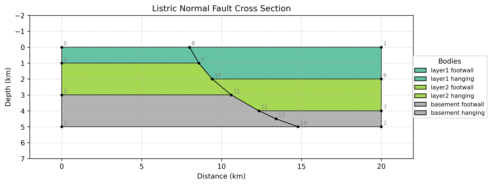
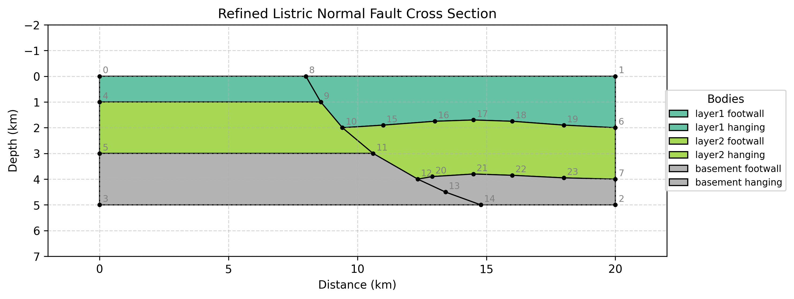
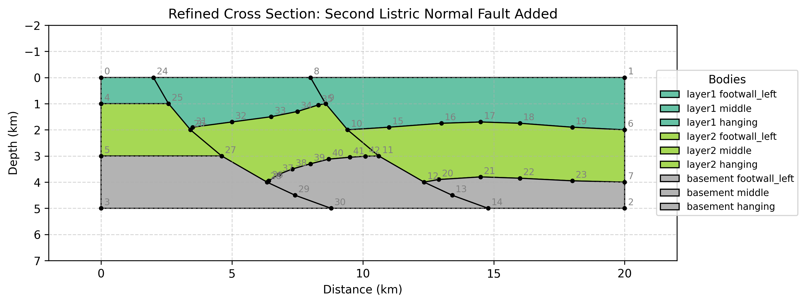
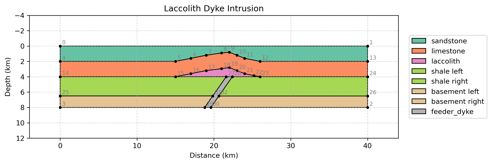
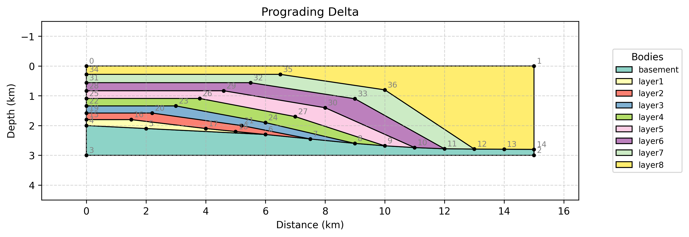

# GeoSIRR

GeoSIRR: Geological Section Interpretation, Reconstruction & Refinement

---

## Overview

GeoSIRR is a Python-based application for generating, interpreting, refining, and visualizing geological cross-sections using Large Language Models ([LLMs]).
It uses the Domain Specific Language (DSL) designed for geological cross-sections to translate free-form geological narratives into structured, coordinate-based geometries.
This command-line interface (CLI) version of GeoSIRR allows users to generate geological cross-sections from text descriptions and is able to:

1. Validate the user's geological description for completeness.
2. Generate a structured text (DSL) representation of the cross-section using LLMs.
3. Validate the generated output for format and topological correctness.
4. Visualize the result using [Matplotlib].
5. Refine existing sections based on user instructions.
6. Answer questions related to the generated sections.

---

## Prerequisites

- [Python] 3.12
- [PIP] package manager
- [Conda] (optional, for environment management)
- [OpenAI] API Key (currently GeoSIRR supports only OpenAI's GPT models)

---

## Installation

To install packages you can use either [pip], [conda] or any other package manager.
Below are the instructions for [pip](#installation-using-pip) and [conda](#installation-using-conda).

### Installation using pip

Install the required Python packages:

```bash
pip install .
```

or alternatively, install from the [`requirements.txt`](requirements.txt) file:

```bash
pip install -r requirements.txt
```

### Installation using conda

Create a new conda environment and install the required packages from the provided [`environment.yml`](environment.yml) file. This file contains all the necessary Python dependencies.

Type this command, for instance, in [Miniforge] prompt:

```bash
conda env create -f environment.yml
```

or just

```bash
conda env create
```

Then activate the environment:

```bash
conda activate geosirr
```

---

## Uninstallation

To uninstall GeoSIRR dependencies, you can use pip:

```bash
pip uninstall -r requirements.txt -y
```

or if you installed using conda, you can remove the environment:

```bash
conda env remove -n geosirr
```

---

## Configuration

This application requires an OpenAI API key to function.

1. Locate or create the `.env` file in the root application directory.
2. Open the file with a text editor.
3. Add your actual API key like that:

   ```plaintext
   OPENAI_API_KEY=sk-proj-123456789...
   ```

4. Save the file.

Alternatively, if the `.env` file is not configured, the application will prompt you to enter your API key upon startup and will save it to a local file for future use.

**Note: The key is stored only locally and is not shared or transmitted to any external servers except OpenAI's API endpoints.**

---

## Usage

To start the application, run the following command in your terminal:

```bash
python main.py
```

### Select LLM

Upon startup, you will be prompted to select an LLM from a list of three most relevant OpenAI models, e.g.:

1. gpt-5 (default, recommended)
2. gpt-5.1
3. gpt-5.2

you can also enter a custom LLM name if your desired model is not listed (option 4).

If you select a custom LLM name, the application will validate whether the specified model is recognized. If the model is not recognized, a list of valid models will be displayed, and you can use option 4 again to re-enter a valid model name.

Select 0 to exit the application.

### Main Menu

Upon selecting the [LLM], you will have the following options:

1. **Run Example (Select from Templates)**
   - Choose from a list of pre-defined geological scenarios (e.g., Normal Fault, Thrust Fault, etc.).
   - This is recommended for first-time users to test the system.

2. **Enter Custom Description**
   - Type or paste your own geological description.
   - Press Enter twice to submit the description.

Option 0 exits the application.

### Output

When you run a generation, the application will produce both text and image files representing the geological cross-section. The cross-section image will also be displayed in a pop-up window.
See the [examples](#examples) section below for sample outputs.

Generated files are saved in the `output` directory.

- **Text Files (.txt):** Contain the coordinate and polygon (DSL) definitions of the cross-section.
- **Image Files (.png):** Visualizations of the generated cross-sections.

Files are named with a timestamp (e.g., `section_2025-12-26_10-30-00.png`) to prevent overwriting.

DSL definitions can be found in the main prompt in file `prompts/section_text_generation_prompt.md`.

### Refining Sections

After generating a section, you can choose to refine it by providing additional instructions (e.g., *"Make the fault steeper"* or *"Add more layers"*).
Simply enter your instructions when prompted and press Enter twice to submit.
The application will update the section accordingly and save the new output files.

### Asking Questions related to Sections

Users can also ask questions related to the generated sections (e.g., *"What is the dip angle of the fault?"*).
Simply type your question when prompted and press Enter twice to submit.
The applications will send the question to the LLM, which will analyze the section and provide answer based on the data and geological knowledge.

---

## Examples

You can find example DSL definitions for geological cross-sections together with their corresponding output files in the `examples` directory.
Below are some of the examples included.

### Example 1: Listric Normal Fault Example

This example demonstrates a geological cross-section featuring a listric normal fault.
A rollover folding in the hanging wall is added in the first refinement, and a second listric fault is added in the second refinement.

#### Visualized Listric Normal Fault Cross Section



DSL definition is in file: [`examples/example_listric_normal_fault_2.txt`](examples/example_listric_normal_fault_2.txt)

#### Original Description for Listric Normal Fault Cross Section

##### Section Overview
A vertical cross-section showing a **listric normal fault** in an extensional tectonic setting.

##### Section Extent
* **Horizontal:** 0 km to 20 km
* **Vertical:** 0 km (surface) to 5 km (depth)

##### Geological Features

###### Fault F1 (Listric Normal Fault)
- **Location:** Surface trace at x = 8 km
- **Dip:** 60° to the east (dipping RIGHT/eastward)
- **Displacement:** 1 km vertical throw
- **Type:** Normal fault - extensional
- **Curvature** Curving eastwards, flattening to a 20° dip at the depth of 5 km. Curvature is approximated with 6 short straight segments.
- **Motion:** Hanging wall (EAST side - above the eastward-dipping plane) moves DOWN

###### Structural Blocks
1. **Western Block (Footwall)** - 0-8 km
   - Relatively uplifted (higher stratigraphic position)
   
2. **Eastern Block (Hanging Wall)** - 8-20 km  
   - Downthrown by 1 km (layers at deeper depths)

##### Stratigraphic Layers

###### Layer 1 (Top - Youngest)
- **Lithology:** Sandstone and shale
- **Thickness:** 1 km in the footwall, thickening to 2 km in the hanging wall (due to syn-tectonic deposition).

###### Layer 2 (Middle)
- **Lithology:** Limestone
- **Thickness:** 2 km

###### Layer 3 (Bottom - Oldest)
- **Lithology:** Basement rocks
- **Thickness:** 2 km in the footwall, thinning to 1 km in the hanging wall to accommodate fault displacement and section base.

#### Refined Listric Normal Fault Cross Sections

Below are the results for the same cross-section after refining of the initial generation:

- Refinement Instruction: *"Add a geologically consistent rollover folding to the hanging wall of the listric fault"*



- Refinement Instruction: *"Add a parallel listric fault with a similar rollover folding starting at x=2 km"*



Resulting DSL definitions are in files:
- [`examples/example_listric_normal_fault_2_refined.txt`](examples/example_listric_normal_fault_2_refined.txt)
- [`examples/example_listric_normal_fault_2_refined_2.txt`](examples/example_listric_normal_fault_2_refined_2.txt)

### Example 2: Laccolith Dyke Intrusion

This example demonstrates a geological cross-section featuring a laccolith dyke intrusion.

#### Visualized Laccolith Dyke Intrusion Cross Section



DSL definition is in file: [`examples/example_laccolith_dyke_2.txt`](examples/example_laccolith_dyke_2.txt)

#### Original Description for Laccolith Dyke Intrusion Cross Section

##### Section Extent
* **Horizontal:** 0 km to 40 km
* **Vertical:** 0 km (surface) to 8 km (depth)

##### Geological Features

###### Feeder Dyke
- **Width:** 0.8 km
- **Dip:** 75° east
- **Location:** Bottom at x=19 km (depth 8 km), top at x=22 km (depth 5 km)
- **Lithology:** Basalt

###### Laccolith Sill
- **Type:** Lens-shaped intrusion at top of shale layer (5 km depth)
- **Peak:** x=22 km, thickness 1.2 km
- **West side:** Gradual taper from x=15 km to x=22 km
- **East side:** Steeper taper from x=22 km to x=26 km
- **Edges:** Taper smoothly to zero thickness
- **Top:** Smooth dome shape
- **Lithology:** Diorite

###### Layer Deformation
- Layers 1 and 2 bend upward over laccolith, maintaining constant 2 km thickness
- Maximum uplift ~1.2 km at x=22 km
- Layers return to flat beyond x=15 km (west) and x=26 km (east)

##### Stratigraphic Layers
- **Layer 1 (Sandstone):** 2 km thick, deformed over laccolith
- **Layer 2 (Limestone):** 2 km thick, deformed over laccolith
- **Layer 3 (Shale):** 2.5 km thick, laccolith intrudes at top
- **Layer 4 (Basement):** 2.5 km thick, flat

### Example 3: Prograding Delta

This example illustrates a geological cross-section of a prograding delta system with multiple sedimentary layers.

#### Visualized Prograding Delta Cross Section



DSL definition is in file: [`examples/example_prograding_delta.txt`](examples/example_prograding_delta.txt)

### Original Description for Prograding Delta Cross Section

Draw a w-E cross-section showing an overall progradation of a delta. The basement is 1 km thick in the W and 0.2 km in the E.
W-E is 15 km in length.
At 2 km the basement shows thinning towards W. Above the basement, there are 8 layers. In the west, the one at the bottom is 0.2 km in thickness and as you go up in the section the thicknesses of the layers gradually increase to 0.5 km. These layers gradually pinchout as you go towards E and overall thicknes reach to 2 km. The section is progradational, and units show clear cliniforms.

---

## Troubleshooting

**Issue: "OpenAI API Key not found"**
- Ensure you have entered your key in the `.env` file correctly.
- Ensure there are no extra spaces around the key.

**Issue: "Module not found"**
- Ensure you have installed all dependencies using `pip install .`.

**Issue: Topology Validation Errors**
- The LLM may occasionally generate geometrically invalid shapes. If this happens, try generating the section again or refining the description to be more specific.

## Versioning

GeoSIRR uses semantic versioning. The release version is defined in [`pyproject.toml`](pyproject.toml).
Please refer to the [CHANGELOG.md](CHANGELOG.md) file for a detailed list of changes in each version.

## Acknowledgements

The project was supported by the Center for Integrative Petroleum Research ([CIPR]) at King Fahd University of Petroleum and Minerals ([KFUPM]) and inspired by [Geo-LM] project.

## Authors

- Denis Anikiev - [GitHub](https://github.com/danikiev) - [ORCID](https://orcid.org/0000-0002-4729-2659)
- Juan E. Mosquera - [GitHub](https://github.com/LunarPerovskite) - [ORCID](https://orcid.org/0009-0006-5315-016X)

## Citing

This work is described in the following manuscript, which you can cite when using GeoSIRR in your research:

Anikiev, D., Mosquera, J. E. , Ayranci, K., Bott, J., Waheed, U. b. (2026). GeoSIRR 1.0: Conversational Geological Cross-Section Modeling Using Large Language Models. (submitted to Geoscientific Model Development).

## License

This project is licensed under the GNU General Public License v3.0 - see the [LICENSE](LICENSE) file for details.

[cipr]: https://cpg.kfupm.edu.sa/cipr
[conda]: https://docs.conda.io/en/latest
[geo-lm]: https://github.com/williamjsdavis/geo-lm
[kfupm]: https://www.kfupm.edu.sa
[llms]: https://en.wikipedia.org/wiki/Large_language_model
[matplotlib]: https://matplotlib.org
[miniforge]: https://github.com/conda-forge/miniforge
[openai]: https://openai.com
[pip]: https://pip.pypa.io/en/stable
[python]: https://www.python.org
