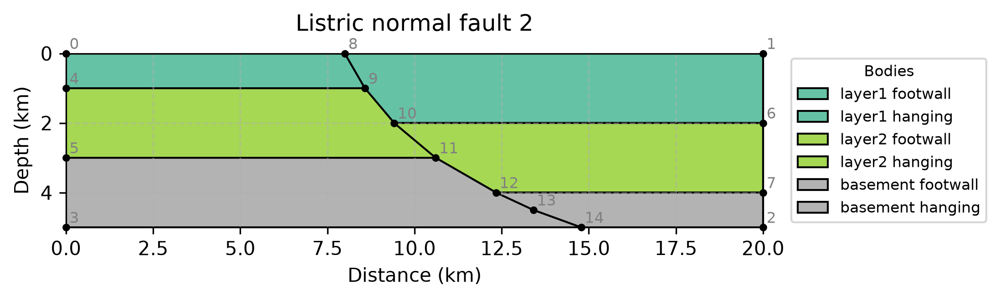
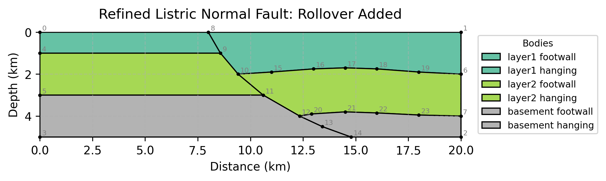
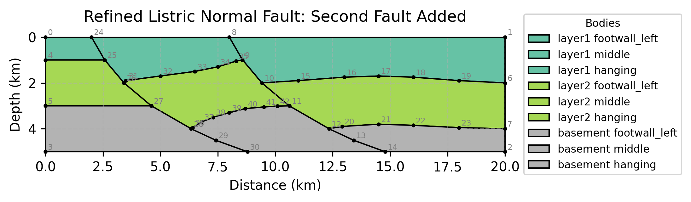
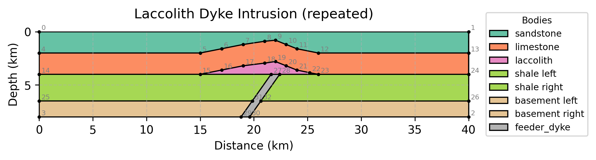
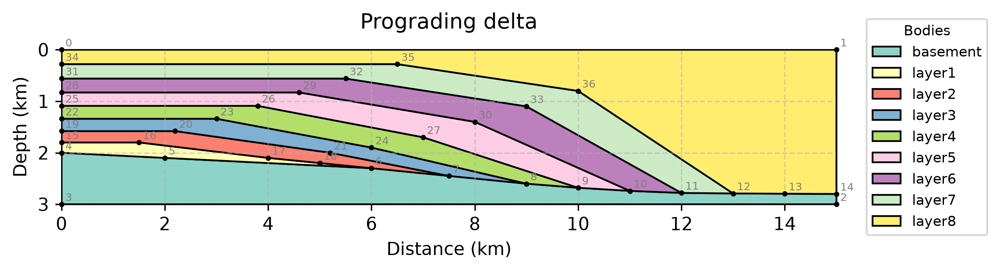

# GeoSIRR

[](https://zenodo.org/badge/latestdoi/1124047636)

GeoSIRR: Geological Section Interpretation, Reconstruction & Refinement

---

## Overview

GeoSIRR is a Python-based application for generating, interpreting, refining, and visualizing geological cross-sections using Large Language Models ([LLMs]).
It uses the Domain Specific Language (DSL) designed for geological cross-sections to translate free-form geological narratives into structured, coordinate-based geometries.
This command-line interface (CLI) version of GeoSIRR allows users to generate geological cross-sections from text descriptions and is able to:

1. Validate the user's geological description for completeness.
2. Generate a structured text (DSL) representation of the cross-section using LLMs.
3. Validate the generated output for format and topological correctness.
4. Visualize the result using [Matplotlib].
5. Refine existing sections based on user instructions.
6. Answer questions related to the generated sections.

---

## Prerequisites

- A local copy of this repository
- One of the following Python environment options:
   - [Conda] or [Miniforge] (recommended), or
   - [Python] 3.12 with its built-in `venv` module and [pip]
- One of the following provider setups:
   - [OpenAI] API Key, or
   - An accessible local or remote [Ollama] server with at least one pulled model

---

## Installation

First, clone the repository and enter its root directory:

```bash
git clone https://github.com/CPG-KFUPM/GeoSIRR.git
cd GeoSIRR
```

Alternatively, download and extract the repository archive, then open a terminal in the extracted `GeoSIRR` directory.

Choose either the conda or `venv` installation below. Keep the selected environment activated and run all GeoSIRR commands from the repository root.

### Option 1: Conda (recommended)

Create the `geosirr` environment from [`environment.yml`](environment.yml):

```bash
conda env create -f environment.yml
conda activate geosirr
```

If the `geosirr` environment already exists, update it instead:

```bash
conda env update -n geosirr -f environment.yml
conda activate geosirr
```

### Option 2: Python virtual environment (`venv`)

Create a Python 3.12 virtual environment.

On macOS or Linux:

```bash
python3.12 -m venv .venv
source .venv/bin/activate
```

On Windows PowerShell:

```bash
py -3.12 -m venv .venv
.\.venv\Scripts\Activate.ps1
```

Then install the dependencies into the activated environment:

```bash
python -m pip install --upgrade pip
python -m pip install -r requirements.txt
```

The requirements file pins the complete dependency set validated with Python 3.12, so conda and `venv` users receive the same tested package versions.

If you don't have Python 3.12 installed, you can install it from the official [Python website](https://www.python.org/downloads/release/python-3120/).

On Ubuntu, you can install Python 3.12 with:

```bash
sudo apt update
sudo apt install python3.12 python3.12-venv python3.12-dev
```

and on macOS, you can use [Homebrew](https://brew.sh/):

```bash
brew install python@3.12
```

### Verify the installation

With either environment activated, run:

```bash
python -c "import main; print('GeoSIRR installation is ready')"
```

Then start GeoSIRR:

```bash
python main.py
```

---

## Uninstallation

For a `venv` installation, deactivate the environment with

```bash
deactivate
```

and delete the `.venv` directory. This removes the isolated environment without affecting other Python installations.

For a conda installation, deactivate and remove the environment:

```bash
conda deactivate
conda env remove -n geosirr
```

Additionally, to clean up package caches, run:

```bash
conda clean --all
```

---

## Configuration

GeoSIRR can run with either OpenAI or Ollama.

### OpenAI configuration

1. Locate or create the `.env` file in the root application directory.
2. Open the file with a text editor.
3. Add your actual API key like that:

   ```plaintext
   OPENAI_API_KEY=sk-proj-123456789...
   ```

4. Save the file.

Alternatively, if the `.env` file is not configured, the application will prompt you to enter your API key upon startup and will save it to a local file for future use.

**Note: The key is stored only locally and is not shared or transmitted to any external servers except OpenAI's API endpoints.**

### Ollama configuration

1. Install [Ollama].
2. Start Ollama service:

   ```bash
   ollama serve
   ```

3. Pull a model (example):

   ```bash
   ollama pull gemma4:e4b
   ```

4. Optional: set a custom local or remote Ollama host in the repository `.env` file:

   ```plaintext
   OLLAMA_HOST=http://your-ollama-host:11434
   ```

   GeoSIRR (`main.py`) and the uncertainty-quantification experiment (`experiments/uq_experiment.py`) both read this variable.
   If it is absent, they use `http://localhost:11434`. The `.env` file is ignored by Git, so machine-specific host addresses and API keys remain local.

---

## Usage

From the repository root, activate the environment you created during installation and run:

```bash
python main.py
```

### Run an Example Non-Interactively

Run a named template without the provider, model, template, refinement, or plot-window prompts. For example, generate the Domino-style Listric Rift with GPT-5.6:

```bash
python main.py \
  --template "Domino-style Listric Rift" \
  --backend openai \
  --model gpt-5.6
```

The command validates the template description, generates and validates the cross-section, saves the DSL text and PNG plot in `output/`, and then exits. `--backend` accepts `openai` or `ollama`; omit `--model` to use `gpt-5.6`.

### Select LLM Provider and Model

Upon startup, you will be prompted to select an LLM provider:

1. OpenAI (cloud)
2. Ollama (local/cloud)

Then you can select a model for that provider.

For OpenAI, the default shortlist is:

1. gpt-5.6 (default, recommended)
2. gpt-5.5
3. gpt-5.4
4. gpt-5.3
5. gpt-5.2
6. gpt-5.1
7. gpt-5

For Ollama, GeoSIRR will list your local models discovered from Ollama.
You can also enter a custom LLM name if your desired model is not listed.

If you select a custom LLM name, the application will validate whether the specified model is recognized. If the model is not recognized, a list of valid models will be displayed, and you can re-enter a valid model name.

To use a different Ollama host, set the `OLLAMA_HOST` environment variable in the `.env` file or in your shell before starting the application:

```bash
export OLLAMA_HOST=http://your-ollama-host:11434
```

To exit the application select 0.

### Main Menu

Upon selecting the [LLM], you will have the following options:

1. **Run Example (Select from Templates)**
   - Choose from a list of pre-defined geological scenarios (e.g., Normal Fault, Thrust Fault, etc.).
   - This is recommended for first-time users to test the system.

2. **Enter Custom Description**
   - Type or paste your own geological description.
   - Press Enter twice to submit the description.

Option 0 exits the application.

### Output

When you run a generation, the application will produce both text and image files representing the geological cross-section. The cross-section image will also be displayed in a pop-up window.
See the [examples](#examples) section below for sample outputs.

Generated files are saved in the `output` directory.

- **Text Files (.txt):** Contain the coordinate and polygon (DSL) definitions of the cross-section.
- **Image Files (.png):** Visualizations of the generated cross-sections.
- **Run Logs (.log):** Start/end timestamps, status, and runtime for every generation stage and the complete workflow.

Files are named with a timestamp (e.g., `section_2025-12-26_10-30-00.png`) to prevent overwriting.

### Plot an existing cross-section file

To create a PNG from an existing GeoSIRR text definition without starting the interactive LLM workflow, run:

```bash
python plot_section.py examples/example_syn-rift_half-graben.txt \
  --title "Syn-rift half-graben" \
  --padding 0.2 --legend-padding 0.35 --legend-gap 0.05 --font-size 6 \
  --vertex-font-size 5 --line-width 0.7 --vertex-size 2 \
  --title-padding 12 --figsize 12 7
```

This writes `examples/example_syn-rift_half-graben.png` by default. `--padding` controls the white area around the model boundaries, while `--legend-padding` reserves a fraction of the figure width to the right of the section. `--legend-gap` controls the horizontal gap directly between the model and legend. `--line-width`, `--vertex-size`, and `--vertex-font-size` control polygon boundaries, vertex dots, and vertex labels respectively; `--title-padding` controls the title-to-model distance. Use a smaller `--font-size` or a larger `--legend-padding` for detailed sections. Set an explicit output path with `--output path/to/section.png`.

To regenerate every valid text example at once, run:

```bash
python examples/plot_examples.py
```

Edit `DEFAULT_OPTIONS` in `examples/plot_examples.py` to change shared settings, or `PLOT_OPTIONS` to override settings for an individual example. Files that are not GeoSIRR cross-section definitions are skipped.

DSL definitions can be found in the main prompt in file [`prompts/section_text_generation.md`](prompts/section_text_generation.md).

### Uncertainty-quantification experiment

The experiment runner [`experiments/uq_experiment.py`](experiments/uq_experiment.py) executes ten independent GeoSIRR generations from a Markdown description and analyzes only the final returned geometry from each run. It supports Ollama (the default) and OpenAI backends. For Ollama, it uses the exact requested model, never pulls or substitutes a model, and reads the server from `OLLAMA_HOST` in `.env`. OpenAI runs use `OPENAI_API_KEY` from the environment or `.env`. The default model is `gemma4:31b` with the Ollama backend.

The analysis reruns both GeoSIRR validators on every final output, reports generation statistics, and overlays every declared vertex from each valid model. Different descriptions can be supplied with `--description`.

Three descriptions are provided:

- [`experiments/listric_fault_baseline.md`](experiments/listric_fault_baseline.md) reproduces the original template description.
- [`experiments/listric_fault_constrained.md`](experiments/listric_fault_constrained.md) fixes the fault endpoint at $(x,z)=(16,-5)$ km and reinforces the six-segment construction to test whether a more specific prompt reduces generated variability.
- [`experiments/synrift_half_graben.md`](experiments/synrift_half_graben.md) defines a complex syn-rift half-graben with interacting listric and antithetic faults, a rollover, growth strata, an angular unconformity, and post-rift drape units.

With the `geosirr` environment activated, run the baseline experiment with the defaults:

```bash
python experiments/uq_experiment.py
```

Run the constrained-description experiment separately:

```bash
python experiments/uq_experiment.py \
  --description experiments/listric_fault_constrained.md
```

Override the model when required, e.g.:

```bash
python experiments/uq_experiment.py --model gemma4:26b
```

Run the same experiment with an OpenAI model, for example:

```bash
python experiments/uq_experiment.py --backend openai --model gpt-5.6
```

Each model/description combination receives a separate directory named `output/uq_<description>_<model>` for Ollama, or `output/uq_<description>_<model>_openai` for OpenAI. A completed directory can be reanalyzed without contacting an LLM provider:

```bash
python experiments/uq_experiment.py \
  --description experiments/listric_fault_constrained.md \
  --analyze-only
```

Use `--output-dir` when reading or writing a non-default directory. Existing per-run records in that directory are retained and skipped, allowing an interrupted experiment to resume.

The analysis writes `uq_geometry_variability.png`, which overlays the final generated vertices and internal contacts from all valid runs.
Use `--vertex-size` to change the generated-vertex marker area in that figure; the default is `20` points squared.

The reported generation success rate is

$$
R_{\mathrm{gen}}=\frac{N_{\mathrm{valid}}}{N_{\mathrm{attempted}}},
$$

where $N_{\mathrm{valid}}$ is the number of final outputs passing both existing GeoSIRR validators. The summary also reports generation attempts, runtimes, and the vertex and polygon counts of valid models. The LLM model and backend are written to `summary.md` and displayed in the figure legend.

Each run's vertices are plotted as equal-size transparent points in a separate color. DSL vertex IDs are not matched between runs. Instead, the analysis identifies side-boundary nodes as vertices at the minimum or maximum horizontal coordinate. It determines the expected boundary-coordinate set as the modal set across valid runs and checks that every run has exactly that set. If this check fails, no mean line is drawn.

When the boundary check passes, the side-boundary nodes are removed. The remaining interior path in each run is ordered by depth and interpolated at 101 common depths. The black mean line is

$$
\bar{x}(z_k)=\frac{1}{N_{\mathrm{valid}}}\sum_{r=1}^{N_{\mathrm{valid}}}x_r(z_k).
$$

This depth-based interpolation permits different generated vertex counts without assuming that their IDs correspond.

The background is a generic internal-contact density map. For realization $r$, $E_r$ is the union of polygon edges shared by two polygons; exterior section-boundary edges are excluded. At grid location $\mathbf q$, $d(\mathbf q,E_r)$ is the shortest distance to the internal-contact geometry in that realization. The displayed value is

$$
D_\sigma(\mathbf q)=\frac{1}{N_{\mathrm{valid}}}\sum_{r=1}^{N_{\mathrm{valid}}}\exp\left(-\frac{d(\mathbf q,E_r)^2}{2\sigma^2}\right),\qquad \sigma=0.100\ \mathrm{km}.
$$

Each realization contributes one smooth band around every internal contact: it is $1$ on the contact and decays with distance at a scale of $\sigma$. Averaging these bands yields a continuous map for all structural contacts, including a fault that separates polygons with the same base-unit label. A stable contact therefore forms a narrow, high-density band. A contact whose position varies between runs forms a broader, lower-density band; where alternative contacts overlap, their contributions combine.

This is generated-contact concentration, not a probability that a geological contact occurs at a real subsurface location. The plot and mean line measure sensitivity to repeated generation and prompt specificity, not geological epistemic uncertainty.

### Refining Sections

After generating a section, you can choose to refine it by providing additional instructions (e.g., *"Make the fault steeper"* or *"Add more layers"*).
Simply enter your instructions when prompted and press Enter twice to submit.
The application will update the section accordingly and save the new output files.

### Asking Questions related to Sections

Users can also ask questions related to the generated sections (e.g., *"What is the dip angle of the fault?"*).
Simply type your question when prompted and press Enter twice to submit.
The applications will send the question to the LLM, which will analyze the section and provide answer based on the data and geological knowledge.

---

## Examples

You can find example DSL definitions for geological cross-sections together with their corresponding output files in the `examples` directory.
Below are some of the examples included.

### Example 1: Listric Normal Fault Example

This example demonstrates a geological cross-section featuring a listric normal fault.
A rollover folding in the hanging wall is added in the first refinement, and a second listric fault is added in the second refinement.

#### Visualized Listric Normal Fault Cross Section



DSL definition is in file: [`examples/example_listric_normal_fault_2.txt`](examples/example_listric_normal_fault_2.txt)

#### Original Description for Listric Normal Fault Cross Section

##### Section Overview
A vertical cross-section showing a **listric normal fault** in an extensional tectonic setting.

##### Section Extent
* **Horizontal:** 0 km to 20 km
* **Vertical:** 0 km (surface) to 5 km (depth)

##### Geological Features

###### Fault F1 (Listric Normal Fault)
- **Location:** Surface trace at x = 8 km
- **Dip:** 60° to the east (dipping RIGHT/eastward)
- **Displacement:** 1 km vertical throw
- **Type:** Normal fault - extensional
- **Curvature** Curving eastwards, flattening to a 20° dip at the depth of 5 km. Curvature is approximated with 6 short straight segments.
- **Motion:** Hanging wall (EAST side - above the eastward-dipping plane) moves DOWN

###### Structural Blocks
1. **Western Block (Footwall)** - 0-8 km
   - Relatively uplifted (higher stratigraphic position)
   
2. **Eastern Block (Hanging Wall)** - 8-20 km  
   - Downthrown by 1 km (layers at deeper depths)

##### Stratigraphic Layers

###### Layer 1 (Top - Youngest)
- **Lithology:** Sandstone and shale
- **Thickness:** 1 km in the footwall, thickening to 2 km in the hanging wall (due to syn-tectonic deposition).

###### Layer 2 (Middle)
- **Lithology:** Limestone
- **Thickness:** 2 km

###### Layer 3 (Bottom - Oldest)
- **Lithology:** Basement rocks
- **Thickness:** 2 km in the footwall, thinning to 1 km in the hanging wall to accommodate fault displacement and section base.

#### Refined Listric Normal Fault Cross Sections

Below are the results for the same cross-section after refining of the initial generation:

- Refinement Instruction: *"Add a geologically consistent rollover folding to the hanging wall of the listric fault"*



- Refinement Instruction: *"Add a parallel listric fault with a similar rollover folding starting at x=2 km"*



Resulting DSL definitions are in files:
- [`examples/example_listric_normal_fault_2_refined.txt`](examples/example_listric_normal_fault_2_refined.txt)
- [`examples/example_listric_normal_fault_2_refined_2.txt`](examples/example_listric_normal_fault_2_refined_2.txt)

### Example 2: Laccolith Dyke Intrusion

This example demonstrates a geological cross-section featuring a laccolith dyke intrusion.

#### Visualized Laccolith Dyke Intrusion Cross Section



DSL definition is in file: [`examples/example_laccolith_dyke_2.txt`](examples/example_laccolith_dyke_2.txt)

#### Original Description for Laccolith Dyke Intrusion Cross Section

##### Section Extent
* **Horizontal:** 0 km to 40 km
* **Vertical:** 0 km (surface) to 8 km (depth)

##### Geological Features

###### Feeder Dyke
- **Width:** 0.8 km
- **Dip:** 75° east
- **Location:** Bottom at x=19 km (depth 8 km), top at x=22 km (depth 5 km)
- **Lithology:** Basalt

###### Laccolith Sill
- **Type:** Lens-shaped intrusion at top of shale layer (5 km depth)
- **Peak:** x=22 km, thickness 1.2 km
- **West side:** Gradual taper from x=15 km to x=22 km
- **East side:** Steeper taper from x=22 km to x=26 km
- **Edges:** Taper smoothly to zero thickness
- **Top:** Smooth dome shape
- **Lithology:** Diorite

###### Layer Deformation
- Layers 1 and 2 bend upward over laccolith, maintaining constant 2 km thickness
- Maximum uplift ~1.2 km at x=22 km
- Layers return to flat beyond x=15 km (west) and x=26 km (east)

##### Stratigraphic Layers
- **Layer 1 (Sandstone):** 2 km thick, deformed over laccolith
- **Layer 2 (Limestone):** 2 km thick, deformed over laccolith
- **Layer 3 (Shale):** 2.5 km thick, laccolith intrudes at top
- **Layer 4 (Basement):** 2.5 km thick, flat

### Example 3: Prograding Delta

This example illustrates a geological cross-section of a prograding delta system with multiple sedimentary layers.

#### Visualized Prograding Delta Cross Section



DSL definition is in file: [`examples/example_prograding_delta.txt`](examples/example_prograding_delta.txt)

### Original Description for Prograding Delta Cross Section

Draw a w-E cross-section showing an overall progradation of a delta. The basement is 1 km thick in the W and 0.2 km in the E.
W-E is 15 km in length.
At 2 km the basement shows thinning towards W. Above the basement, there are 8 layers. In the west, the one at the bottom is 0.2 km in thickness and as you go up in the section the thicknesses of the layers gradually increase to 0.5 km. These layers gradually pinchout as you go towards E and overall thicknes reach to 2 km. The section is progradational, and units show clear cliniforms.

---

## Troubleshooting

**Issue: "OpenAI API Key not found"**
- Ensure you have entered your key in the `.env` file correctly.
- Ensure there are no extra spaces around the key.

**Issue: "Ollama server is not running"**
- Start Ollama service with `ollama serve`.
- Ensure `OLLAMA_HOST` points to the running server.

**Issue: "No Ollama models found"**
- Pull at least one model, for example: `ollama pull llama3.1:8b`.

**Issue: "Module not found"**
- Ensure the `geosirr` conda environment or `.venv` virtual environment is activated.
- Ensure you installed the dependencies and are running `python main.py` from the repository root.

**Issue: Topology Validation Errors**
- The LLM may occasionally generate geometrically invalid shapes. If this happens, try generating the section again or refining the description to be more specific.

## Versioning

GeoSIRR uses semantic versioning. The release version is defined in [`pyproject.toml`](pyproject.toml).
Please refer to the [CHANGELOG.md](CHANGELOG.md) file for a detailed list of changes in each version.

## Acknowledgements

The project was supported by the Center for Integrative Petroleum Research ([CIPR]) at King Fahd University of Petroleum and Minerals ([KFUPM]) and inspired by [Geo-LM] project.

## Authors

- Denis Anikiev - [GitHub](https://github.com/danikiev) - [ORCID](https://orcid.org/0000-0002-4729-2659)
- Juan E. Mosquera - [GitHub](https://github.com/LunarPerovskite) - [ORCID](https://orcid.org/0009-0006-5315-016X)

## Citing

This work is described in the following manuscript, which you can cite when using GeoSIRR in your research:

Anikiev, D., Mosquera, J. E. , Ayranci, K., Bott, J., Waheed, U. b. (2026). GeoSIRR 1.0: Conversational Geological Cross-Section Modeling Using Large Language Models. (in review in Geoscientific Model Development).
<https://doi.org/10.5194/egusphere-2025-6545>

Zenodo publication:

Anikiev, D., & Mosquera, J. E. (2025). GeoSIRR: Geological Section Interpretation, Reconstruction & Refinement (1.0.0). Zenodo. 
<https://doi.org/10.5281/zenodo.18097054>

## License

This project is licensed under the GNU General Public License v3.0 - see the [LICENSE](LICENSE) file for details.

[cipr]: https://cpg.kfupm.edu.sa/cipr
[conda]: https://docs.conda.io/en/latest
[geo-lm]: https://github.com/williamjsdavis/geo-lm
[kfupm]: https://www.kfupm.edu.sa
[llms]: https://en.wikipedia.org/wiki/Large_language_model
[matplotlib]: https://matplotlib.org
[miniforge]: https://github.com/conda-forge/miniforge
[ollama]: https://ollama.com
[openai]: https://openai.com
[pip]: https://pip.pypa.io/en/stable
[python]: https://www.python.org
